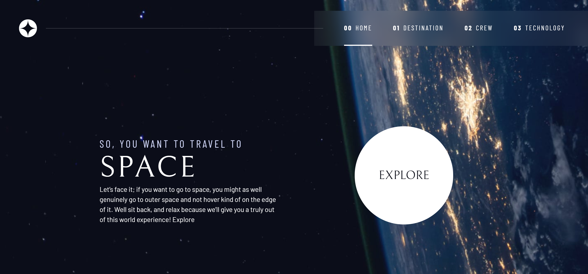

# Space Tourism Website

This was my first project from Frontend Mentors [Space tourism website challenge on Frontend Mentor](https://www.frontendmentor.io/challenges/space-tourism-multipage-website-gRWj1URZ3). Frontend Mentor challenges help you improve your coding skills by building realistic projects. 

# Aim

The aim was to create the above website as close as possible to the original design, although I did make a few tweaks and adjustments which changed the design a little.

### What I learned

This was a great project which I thoroughly enjoyed, as I am a Space nerd too! It was a great opportunity to practice flex and grid, as learning about customs properties and utility classes.

I also implemented a new way to display the mobile navigation, which I think I will continue to use in future designs.

### Built with

* JavaScript
* HTML
* CSS 
  
# Preview

# [Demo] ()

# Author 

Simon Maher

## Acknowledgments

Again, a big shout to Frontend Mentor, a site that helps to develope aspiring web developers by providing realistic, real world working projects.

